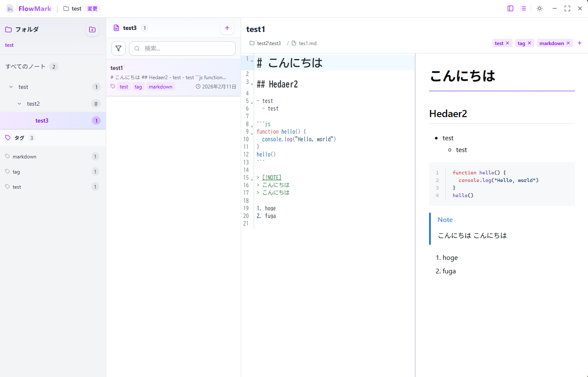

<h1 align="center"> Notyra</h1>



[English version](./README.en.md)

Notyra は、Electron + React で構築されたデスクトップ向け Markdown エディタです。  
ローカルフォルダをルートにして `.md` ファイルを管理し、編集とプレビューを1つの画面で行えます。

## 利用者向け

### 主な機能

- ルートフォルダ配下の Markdown ノートを自動スキャンして一覧表示
- フォルダツリー表示とフォルダ単位のノート絞り込み
- ノート作成 / 移動 / 削除
- フォルダ作成 / 削除
- ノートタイトル・タグのメタデータ編集
- ノート検索（タイトル・抜粋・タグ）
- 並び替え（更新日 / タイトル）
- `editor` / `preview` / `split` レイアウト切り替え
- 自動保存（デバウンス）
- ファイル変更監視による自動リロード
- ノートを別ウィンドウで開く機能

### 使い方（基本フロー）

1. アプリ起動後、ノートの保存先ルートフォルダを選択
2. 左ペインのフォルダツリーから対象フォルダを選択
3. ノート一覧からノートを開く、または新規作成
4. エディタで編集（内容は自動保存）
5. 必要に応じてタグでフィルタ、並び替え、別ウィンドウ表示を利用

### ノート形式

Notyra は Markdown ファイルの front matter を読み取り、メタデータとして扱います。

```yaml
---
title: サンプル
tags:
  - memo
  - notyra
createdAt: 2026-02-12T00:00:00.000Z
updatedAt: 2026-02-12T00:00:00.000Z
---

# 本文
```

## 開発者向け

### 技術スタック

- Electron
- React 19
- TypeScript
- Vite (electron-vite)
- Tailwind CSS v4
- CodeMirror 6
- Vitest
- Biome

### 動作要件

- Node.js: `22.x`（`.nvmrc`）
- pnpm: `10.x`（`packageManager`）
- 対応OS: Windows / macOS（`electron-builder.ts` で設定）

### セットアップ

```bash
pnpm install
```

### 開発

```bash
pnpm dev
```

### 主要コマンド

- `pnpm dev`: 開発モード起動
- `pnpm start`: プレビュー起動
- `pnpm lint`: 静的解析
- `pnpm lint:fix`: 静的解析 + 自動修正
- `pnpm typecheck`: 型チェック
- `pnpm test`: テスト実行
- `pnpm test:watch`: テストウォッチ
- `pnpm test:coverage`: カバレッジ付きテスト
- `pnpm prebuild`: アプリビルド + 配布準備
- `pnpm build`: パッケージビルド
- `pnpm release`: 配布用リリース

### 配布アプリの実行（未署名）

未署名アプリの実行方法は `RUN_UNSIGNED_APPS.md` を参照してください。

### プロジェクト構成（抜粋）

```text
src/
  main/       # Electron main process
  preload/    # contextBridge 経由の API
  renderer/   # React UI
  shared/     # 共通型・定数
```

## コントリビューション

ソースコード上でバグを発見されたら、GitHub 上の Repository にて Issue を作成していただけると助かります。
バグを修正して Pull requests を提出していただけるとさらに助かります。

## ライセンス

MIT
