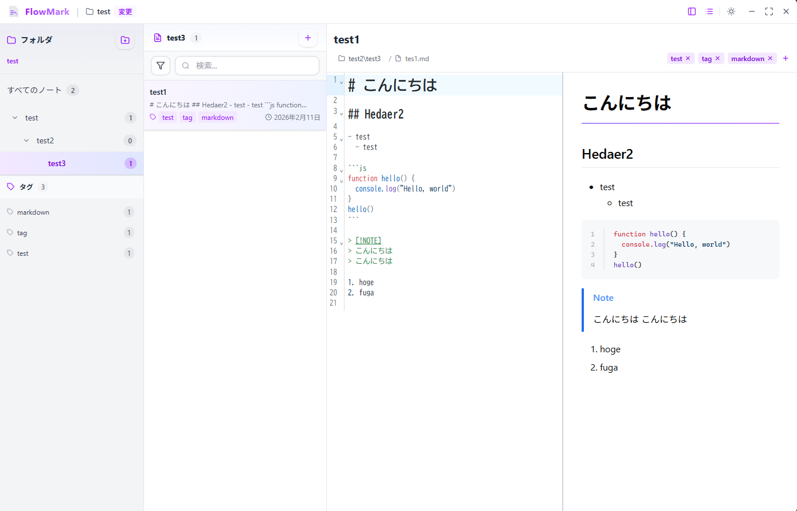

<h1 align="center"> Notyra</h1>



[English version](./README.en.md)

Notyra は、**Tauri v2 + React** で構築されたデスクトップ向け Markdown エディタです。
ローカルフォルダをルートにして `.md` ファイルを管理し、編集とプレビューを1つの画面で行えます。

## 利用者向け

### 主な機能

- ルートフォルダ配下の Markdown ノートを自動スキャンして一覧表示
- フォルダツリー表示とフォルダ単位のノート絞り込み
- ノート作成 / 移動 / 削除
- フォルダ作成 / 削除
- ノートタイトル・タグのメタデータ編集
- ノート検索（タイトル・抜粋・タグ）
- 並び替え（更新日 / タイトル）
- `editor` / `preview` / `split` レイアウト切り替え
- 自動保存（デバウンス）
- ファイル変更監視による自動リロード
- ノートを別ウィンドウで開く機能
- PDF / HTML エクスポート

### 使い方（基本フロー）

1. アプリ起動後、ノートの保存先ルートフォルダを選択
2. 左ペインのフォルダツリーから対象フォルダを選択
3. ノート一覧からノートを開く、または新規作成
4. エディタで編集（内容は自動保存）
5. 必要に応じてタグでフィルタ、並び替え、別ウィンドウ表示を利用

### ノート形式

Notyra は Markdown ファイルの front matter を読み取り、メタデータとして扱います。

```yaml
---
title: サンプル
tags:
  - memo
  - notyra
createdAt: 2026-02-12T00:00:00.000Z
updatedAt: 2026-02-12T00:00:00.000Z
---

# 本文
```

## 開発者向け

### 技術スタック

| レイヤー | 技術 |
|---------|------|
| UI フレームワーク | React 19 + TypeScript |
| デスクトップランタイム | **Tauri v2** (Rust) |
| ビルド | Vite 7 + Tauri CLI |
| スタイリング | Tailwind CSS v4 |
| エディタ | CodeMirror 6 |
| テスト | Vitest |
| リンター | Biome |

### 動作要件

#### ユーザー向けバイナリ実行

- 対応 OS: Windows 10/11 / macOS 12+ / Linux (Ubuntu 22.04+)
- Rust のインストール不要（バイナリに含まれる）

#### 開発環境構築

- Node.js: `24.21.0`（`.nvmrc`）
- pnpm: `12.7.0`（`packageManager`）
- **Rust toolchain**: [rustup](https://rustup.rs/) でインストール
  ```bash
  curl --proto '=https' --tlsv1.2 -sSf https://sh.rustup.rs | sh
  ```
- Linux のみ: `libwebkit2gtk-4.1-dev` 等のシステム依存パッケージが必要
  ```bash
  sudo apt-get install -y libwebkit2gtk-4.1-dev libappindicator3-dev librsvg2-dev patchelf
  ```

### セットアップ

```bash
npm install --global pnpm@12.7.0
pnpm install --frozen-lockfile
```

pnpm 10 から更新する場合は、先に上記のグローバルインストールを実行してください。依存関係のインストールには pnpm を使用します。

### 開発

```bash
pnpm dev        # tauri dev（フロントエンド + バックエンド同時起動）
```

### 主要コマンド

| コマンド | 内容 |
|---------|------|
| `pnpm dev` | 開発モード起動（Tauri dev server） |
| `pnpm build` | 配布用バイナリのビルド（`tauri build`） |
| `pnpm lint` | Biome による静的解析 |
| `pnpm lint:fix` | 静的解析 + 自動修正 |
| `pnpm typecheck` | TypeScript 型チェック |
| `pnpm test` | Vitest テスト実行 |
| `pnpm test:watch` | Vitest ウォッチモード |
| `pnpm test:coverage` | カバレッジ付きテスト |

### プロジェクト構成（抜粋）

```text
src-tauri/          # Tauri / Rust バックエンド
  src/
    commands/       # Tauri コマンド（markdown, image, export, window）
    lib.rs          # アプリエントリ・プラグイン登録
    state.rs        # 共有状態（ファイルウォッチャー等）
  tauri.conf.json   # ウィンドウ設定・CSP・ビルド設定
  Cargo.toml        # Rust 依存関係

src/
  renderer/         # React UI（フロントエンド）
    lib/
      tauriApi.ts   # Tauri invoke ラッパー（IPC アダプター）
      windowState.ts # ウィンドウ状態永続化
    hooks/          # カスタムフック
    components/     # UI コンポーネント
    screens/        # 画面コンポーネント（main, editor）
    plugins/        # rehype プラグイン
  shared/           # 共通型定義
```

### 配布アプリの実行（未署名）

未署名アプリの実行方法は `RUN_UNSIGNED_APPS.md` を参照してください。

### ブランチ運用・リリース

変更用ブランチと `release/vX.Y.Z` ブランチは `main` から作成し、PR のマージ先も `main` にします。
CI は PR の作成・更新時に実行し、release PR のマージ後にタグ・配布パッケージ・リリースドラフトを自動作成します。
手順と `develop` からの移行については [ブランチ運用とリリース](docs/release.md) を参照してください。

## コントリビューション

ソースコード上でバグを発見されたら、GitHub 上の Repository にて Issue を作成していただけると助かります。
バグを修正して Pull requests を提出していただけるとさらに助かります。

## ライセンス

MIT
